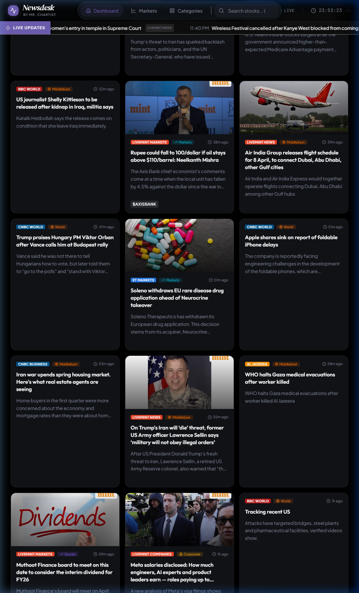

# 📡 Newsdesk — Institutional Market Intelligence Terminal

**Newsdesk** is a high-fidelity, real-time geopolitical and financial intelligence terminal. It aggregates, categorizes, and persistently archives news from over 30+ premium global sources into a sleek, Bloomberg-style interface. 

By leveraging a custom RSS proxy server, an embedded SQLite database, and advanced keyword heuristics, Newsdesk offers a sophisticated, uninterrupted reading experience engineered for professional financial analysis.



---

## ✨ Core Capabilities

### 1. 🌐 Premium Source Aggregation
Aggregates RSS feeds from top-tier institutional and global market sources:
*   **Global Intel**: Bloomberg, Reuters, Financial Times, The Wall Street Journal.
*   **Regional Markets**: Deep coverage of emerging markets, central bank actions, and corporate tracking.
*   **Geopolitics & Defense**: Defense News, macro geopolitics, and conflict tracking.
*   **Emerging Tech**: Dedicated pipelines for Artificial Intelligence and technology trends.

### 2. 🧠 Smart Categorization Engine
A built-in Regex-powered heuristic engine analyzes incoming headlines and automatically routes them into distinct intelligence buckets (`Markets`, `Corporate`, `Geopolitics`, `Defense`, `AI`, `Crypto`), overriding default generic RSS tags to ensure strict categorization.

### 3. 🗄️ Persistent SQLite Memory & Auto-Pruning
Moves beyond temporary in-memory JSON storage by utilizing a robust `better-sqlite3` database to persistently archive news. 
*   **Deduplication**: Enforces strict URL uniqueness.
*   **Auto-Pruning**: Automatically deletes stories older than 30 days to strictly manage disk space and maintain maximum query performance.

### 4. 🛡️ In-Terminal Article Proxy bypass
Features a custom backend proxy endpoint designed to strip restrictive `X-Frame-Options` headers from major news sites. This allows full articles to be rendered directly within a beautifully animated UI modal, ensuring you never have to leave the terminal or open a new tab to consume news.

### 5. 🎨 Institutional Dark-Mode UI
*   **Topography**: Built on standard CSS grid layouts enforcing chronological (left-to-right, top-to-bottom) reading.
*   **Glassmorphism**: Sleek floating navbars and blur effects. 
*   **Micro-interactions**: Framer Motion powers layout shifts and focus indicators.
*   **Live Status**: A unified header shows database connection health and real-time syncing status.

---

## 🏗️ Architecture Stack

### **Frontend**
*   **Framework**: React 18 + Vite
*   **Styling**: Tailwind CSS (Custom Dark Mode tokens)
*   **Icons**: Lucide React
*   **Animations**: Framer Motion
*   **State / Routing**: React Router DOM, Custom React Hooks

### **Backend**
*   **Runtime**: Node.js + Express
*   **Database**: `better-sqlite3` (Sync, zero-config SQL engine)
*   **Parsers**: `fast-xml-parser` (for RSS parsing)
*   **Data Fetching**: Native `fetch` with intelligent fallback intervals (60s, 120s, 300s TTLs based on feed priority).

---

## 🚀 Setup & Execution

1. **Install Dependencies**
   ```bash
   npm install
   ```

2. **Run the Terminal (Frontend & Backend)**
   The project uses `concurrently` to spin up both the Vite dev server and the Node backend proxy simultaneously.
   ```bash
   npm run start
   ```

3. **Endpoints Access**
   *   **Frontend UI**: `http://localhost:5185`
   *   **Backend Proxy**: `http://localhost:3001/api/news`

---

## 📂 Project Structure

```text
/Newsdesk
├── backend/
│   ├── server.js          # Express server & Proxy endpoint
│   ├── db.js              # SQLite database initialization & query models
│   └── feedProxy.js       # RSS fetching engine, heuristic categorization, TTL logic
├── data/
│   └── newsdesk.db        # Automatically generated SQLite storage file
├── src/
│   ├── components/
│   │   ├── layout/        # TopBar, TickerBar
│   │   ├── news/          # ArticleModal, NewsCard, NewsFeed
│   │   └── stats/         # HeroStats
│   ├── data/
│   │   └── categories.ts  # Frontend taxonomy (Icons, colors, labels)
│   ├── pages/
│   │   └── Home.tsx       # Main filtering & terminal view
│   ├── index.css          # Tokenized CSS for institutional dark theme
│   └── App.tsx            # Global layout wrapper
└── package.json           # Concurrent start scripts
```

---

## 👨‍💻 Author & Sponsorship

**Mr. Chartist — Rohit Singh**  
*SEBI Registered Research Analyst (INH000015297)*  

Newsdesk is built as part of the broader **Mr. Chartist** ecosystem to deploy institutional-grade data intelligence to the public. If you found this open-source terminal helpful for your trading and market analysis, consider supporting the project:

💖 **[Sponsor & Support Mr. Chartist](https://mrchartist.com)**  
📱 **[Join the Community](https://t.me/MrChartist)**  
🐦 **[Follow on X (Twitter)](https://twitter.com/mrchartist)**  

*Architected for speed, permanence, and maximum intelligence density.*
