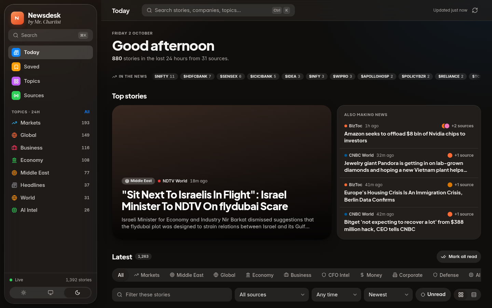
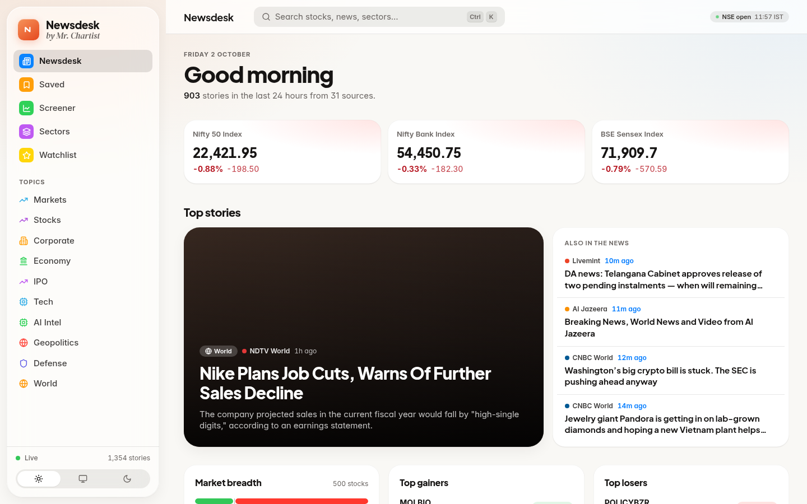
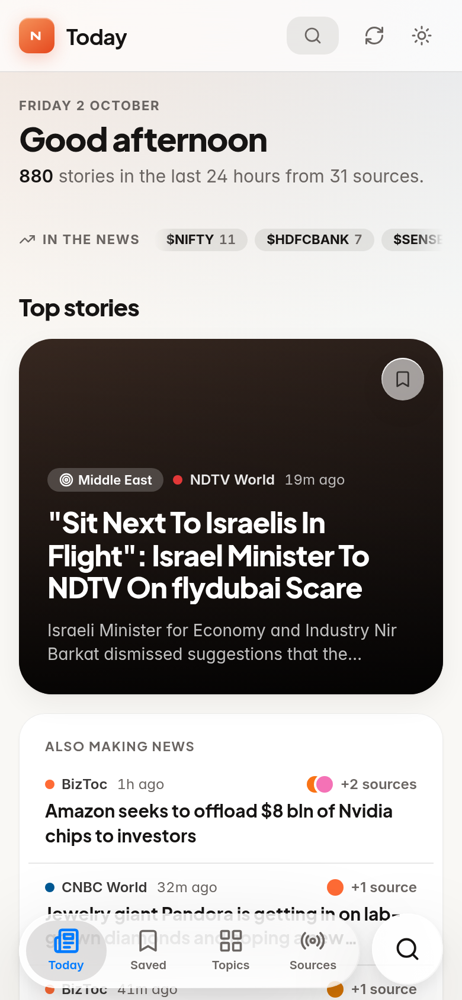

# 📡 Newsdesk — Institutional Market Intelligence Terminal

**Newsdesk** is a high-fidelity, real-time geopolitical and financial intelligence terminal. It aggregates, categorizes, and persistently archives news from over 30+ premium global sources into a sleek, Bloomberg-style interface. 

By leveraging a custom RSS proxy server, an embedded SQLite database, and advanced keyword heuristics, Newsdesk offers a sophisticated, uninterrupted reading experience engineered for professional financial analysis.



<p>
  
  
</p>

---

## ✨ Core Capabilities

### 1. 🌐 Premium Source Aggregation
Aggregates RSS feeds from top-tier institutional and global market sources:
*   **Global Intel**: Bloomberg, Reuters, Financial Times, The Wall Street Journal.
*   **Regional Markets**: Deep coverage of emerging markets, central bank actions, and corporate tracking.
*   **Geopolitics & Defense**: Defense News, macro geopolitics, and conflict tracking.
*   **Emerging Tech**: Dedicated pipelines for Artificial Intelligence and technology trends.

### 2. 🧠 Smart Categorization Engine
A built-in Regex-powered heuristic engine analyzes incoming headlines and automatically routes them into distinct intelligence buckets (`Markets`, `Corporate`, `Geopolitics`, `Defense`, `AI`, `Crypto`), overriding default generic RSS tags to ensure strict categorization.

### 3. 🗄️ Persistent SQLite Memory & Auto-Pruning
Moves beyond temporary in-memory JSON storage by utilizing a robust `better-sqlite3` database to persistently archive news. 
*   **Deduplication**: Enforces strict URL uniqueness.
*   **Auto-Pruning**: Automatically deletes stories older than 30 days to strictly manage disk space and maintain maximum query performance.

### 4. 🛡️ In-Terminal Article Reader
A custom backend proxy serves articles from the app's own origin, dropping restrictive `X-Frame-Options` / CSP headers so full stories render directly inside a beautifully animated reader modal. Opaque Google News redirect links are resolved server-side to the real publisher URL before rendering, and any publisher that still blocks embedding or sits behind a paywall falls back gracefully to a clean "Read on source" card — you never hit a blank page.

### 4b. 🔎 Search, Filter, Sort & Saved Articles
A global control bar lets you search every archived headline (press `/` or ⌘K), filter by source, sort by recency or publisher, and bookmark stories. Saved articles persist in `localStorage`, stay in sync across tabs, and survive backend pruning. The feed paginates with infinite scroll for snappy rendering even across thousands of articles.

### 4c. 📊 Markets, Sectors & Watchlist
The full ~500-stock NSE universe is now browsable, not just summarised:
*   **Screener (`/markets`)**: A sortable, filterable table of every tracked stock — sort by price, change, 1-month performance, 52-week range position, volume or market cap; quick filters for gainers, losers and 52-week extremes; filter by sector or search by name.
*   **Sector Rotation (`/sectors` → `/sector/:name`)**: Every sector is scored for average move, advance/decline breadth, market-cap weight, and bullish-signal share. Drill into a sector to see its leaders & laggards, full constituent table, and — uniquely — **sector-wide news** auto-joined from articles mentioning any company in that sector.
*   **Watchlist (`/watchlist`)**: Star any stock from the screener, a sector, or a company page. Watched symbols persist in `localStorage`, sync across tabs, and power a dedicated view that pairs live quotes with the latest news mentioning those holdings.
*   **Richer company pages**: Week/month/quarter performance, 52-week range position, a sector-peer strip, a one-tap watchlist toggle, and a deep link to the interactive TradingView chart.
*   **Mobile navigation**: A bottom tab bar brings the dashboard, screener, sectors, watchlist, and topics to small screens.

### 5. 🎨 Liquid Glass Design (iOS 26 / macOS 26)
Newsdesk shares its design tokens with [IPO Decode](https://ipodecode.mrchartist.com) so the Mr. Chartist family feels like one product.
*   **Materials**: translucent Liquid Glass (blur + saturation + specular rim) for the sidebar, toolbar, tab bar and sheets; inset-grouped cards for content.
*   **macOS layout**: a floating source-list sidebar with iOS-colour squircle icons, a translucent toolbar, and a large-title page header.
*   **iOS layout**: a floating capsule tab bar, bottom-sheet article reader with grabber, safe-area aware spacing, 44px touch targets.
*   **Appearance**: Light / Auto / Dark (follows macOS & iOS), warm-black `#0F0E0D` and warm-paper `#F9F7F4` surfaces, applied before first paint (no flash).
*   **Type**: Plus Jakarta Sans (display), Inter (body & tabular numerals), DM Serif Display italic (brand accent) — self-hosted in `public/fonts`.
*   **Accessibility**: visible focus rings, reduced-motion, reduced-transparency and high-contrast fallbacks.

### 6. ⌨️ Command Palette & Reading State
Press **⌘K / Ctrl+K** (or `/`) to jump to any stock, sector, topic or page, switch appearance, or search headlines. Articles you open are dimmed in the feed so you can see what is left to read. The home page leads with a "Top stories" block and greets you with the live NSE session state (standard hours, Mon–Fri 9:15–15:30 IST — exchange holidays not included).

### 7. 📈 Price-Action Only
Market views avoid indicator readouts. Breadth is advancers/decliners and stocks near 52-week highs/lows; the screener and company pages use 52-week range position, distance from the high, volume and 1W/1M/3M performance.

---

## 🏗️ Architecture Stack

### **Frontend**
*   **Framework**: React 18 + Vite
*   **Styling**: Tailwind CSS (Custom Dark Mode tokens)
*   **Icons**: Lucide React
*   **Animations**: Framer Motion
*   **State / Routing**: React Router DOM, Custom React Hooks

### **Backend**
*   **Runtime**: Node.js + Express
*   **Database**: `better-sqlite3` (Sync, zero-config SQL engine)
*   **Parsers**: `fast-xml-parser` (for RSS parsing)
*   **Data Fetching**: Native `fetch` with intelligent fallback intervals (60s, 120s, 300s TTLs based on feed priority).

---

## 🚀 Setup & Execution

1. **Install Dependencies**
   ```bash
   npm install
   ```

2. **Run the Terminal (Frontend & Backend)**
   The project uses `concurrently` to spin up both the Vite dev server and the Node backend proxy simultaneously.
   ```bash
   npm run start
   ```

3. **Endpoints Access**
   *   **Frontend UI**: `http://localhost:5185`
   *   **Backend Proxy**: `http://localhost:3001/api/news`

---

## 📂 Project Structure

```text
/Newsdesk
├── backend/
│   ├── server.js          # Express server & Proxy endpoint
│   ├── db.js              # SQLite database initialization & query models
│   └── feedProxy.js       # RSS fetching engine, heuristic categorization, TTL logic
├── data/
│   └── newsdesk.db        # Automatically generated SQLite storage file
├── src/
│   ├── components/
│   │   ├── layout/        # TopBar, TickerBar
│   │   ├── news/          # ArticleModal, NewsCard, NewsFeed
│   │   └── stats/         # HeroStats
│   ├── data/
│   │   └── categories.ts  # Frontend taxonomy (Icons, colors, labels)
│   ├── pages/
│   │   └── Home.tsx       # Main filtering & terminal view
│   ├── index.css          # Tokenized CSS for institutional dark theme
│   └── App.tsx            # Global layout wrapper
└── package.json           # Concurrent start scripts
```

---

## 👨‍💻 Author & Sponsorship

**Mr. Chartist — Rohit Singh**  
*SEBI Registered Research Analyst (INH000015297)*  

Newsdesk is built as part of the broader **Mr. Chartist** ecosystem to deploy institutional-grade data intelligence to the public. If you found this open-source terminal helpful for your trading and market analysis, consider supporting the project:

💖 **[Sponsor & Support Mr. Chartist](https://mrchartist.com)**  
📱 **[Join the Community](https://t.me/MrChartist)**  
🐦 **[Follow on X (Twitter)](https://twitter.com/mrchartist)**  

*Architected for speed, permanence, and maximum intelligence density.*
