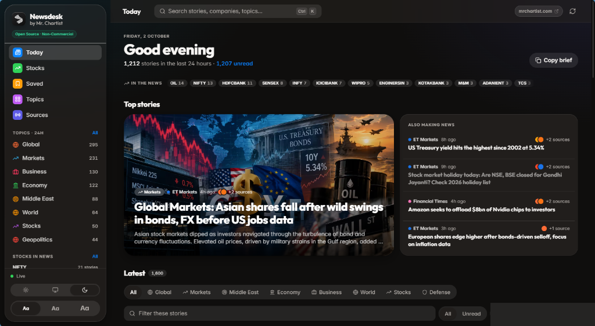
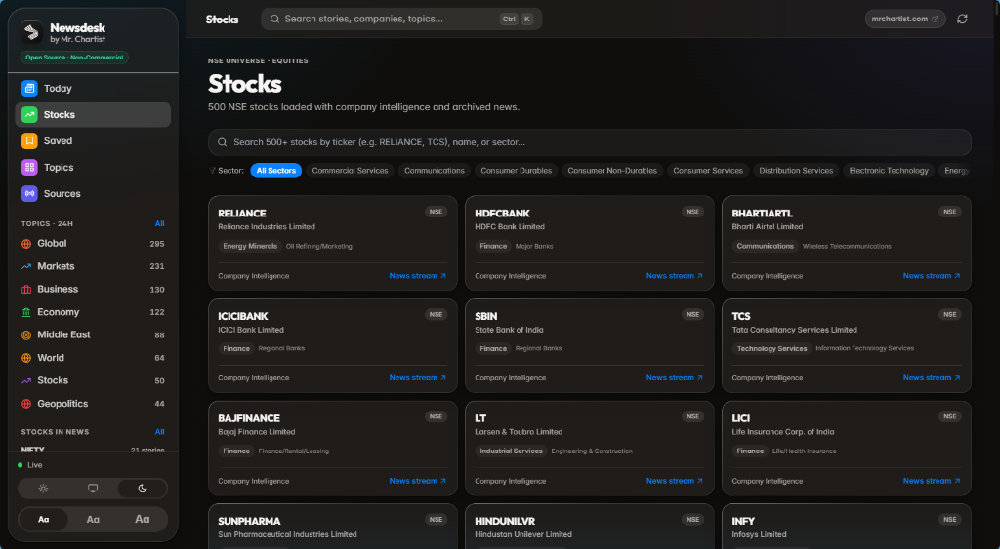
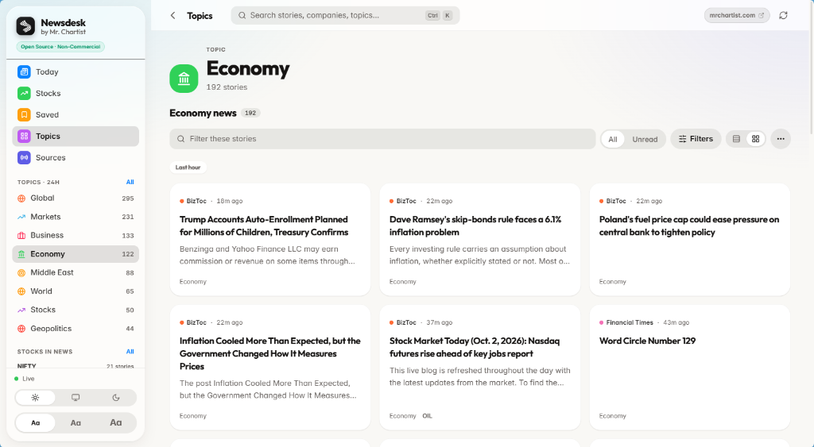
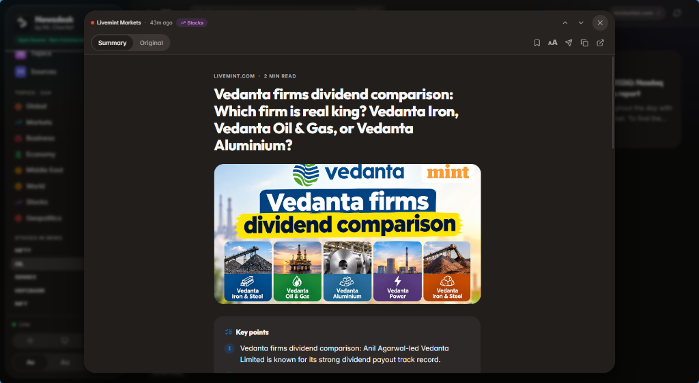
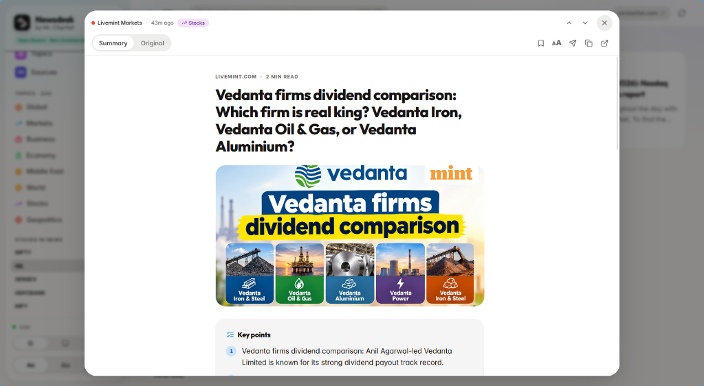

# 📡 Newsdesk — Indian & Global Market Intelligence

<div align="center">


<p><strong>A high-speed, calm terminal for Indian & global market news, grouped into deduplicated stories.</strong></p>

[](./LICENSE)
[](#-sponsorship--support)
[](./LICENSE)
[](#-tech-stack)
[](https://mrchartist.com)

</div>

---

## 🧭 Overview

**Newsdesk** is an open-source, non-commercial market news workstation engineered by **Mr. Chartist (Rohit Singh)**. It connects to 30+ top financial publications and exchanges, aggregates hundreds of live dispatches into SQLite with an automated 30-day rolling retention, deduplicates identical headlines across publications into cohesive **Stories**, and extracts factual points via algorithmic TextRank—all wrapped in an ultra-responsive, liquid-glass workspace.

> [!NOTE]
> **Open Source & Non-Commercial Notice**  
> Newsdesk is published under the **PolyForm Noncommercial License 1.0.0**. It is completely free for individual study, personal trading intelligence, and academic research. Any commercial exploitation, resale, or commercial SaaS deployment is strictly prohibited.

---

## 🖼️ Visual Showcase

### 1. Today Briefing & Multi-Source Story Stream (Dark Mode)
<div align="center">
  
</div>

<br/>

### 2. 500+ Preloaded NSE Stocks Directory & Sector Intelligence (`/stocks`)
<div align="center">
  
</div>

<br/>

### 3. Curated Topic Explorer & Category Streams (Light Mode)
<div align="center">
  
</div>

<br/>

### 4. Algorithmic TextRank Reader (Dark & Light Glass)
<p align="center">
  
  
</p>

---

## ⚡ Key Highlights & Architecture

### 1. Smart Multi-Source Story Clustering
When Reuters, CNBC-TV18, Economic Times, Bloomberg, and Mint report on the same event, Newsdesk consolidates them into a **single unified card** with an *"+N sources"* pill. Read the primary perspective or instantly flip between publisher coverages inside the story view.

### 2. Algorithmic Summaries (Zero LLM Hallucinations)
Instead of error-prone generative AI, Newsdesk employs graph-based **TextRank** extractive summarization:
* Extracts clean article body text while stripping ad networks, cookie consents, and tracking noise.
* Scores sentence importance using cosine graph centrality, lead position weights, and headline co-occurrence.
* Pulls out critical Indian market statistics (₹ crore figures, percentages, quantities) into rapid-glance chips.
* Delivers 100% verbatim sentences directly from the journalists.

### 3. Preloaded 500+ NSE Stock Directory & Company Hub
* Features an embedded, zero-external-dependency catalog of **500+ top Indian stocks** (Reliance, TCS, HDFC Bank, Tata Motors, Infosys, etc.) mapped with official NSE symbols, ISINs, and sector classifications.
* Dedicated **Stocks Directory** (`/stocks`) with sector filters, market cap groupings, search, and instant company intelligence pages (`/company/:symbol`).
* Currency is natively formatted in **Indian Rupees (₹)** throughout.

### 4. Apple Liquid Glass Design System
* Translucent backdrop blur (`backdrop-filter: blur(32px)`), specular rims, and inset tactile materials.
* Typography powered by **Outfit** (display & headers), **Inter** (readable body), and **JetBrains Mono** (financial metrics).
* Full dark mode, light mode, and system preference support with zero flash on hydration (`theme-boot`).
* Full keyboard navigation: `⌘K` / `Ctrl+K` command palette, `J`/`K` navigation, `S` to save, `M` to mark read.

---

## 🏛️ System Architecture

```
                                 [ 30+ Financial RSS / News Feeds ]
                                                 │
                                                 ▼
                                     ┌───────────────────────┐
                                     │   backend/server.js   │
                                     └───────────┬───────────┘
                                                 │
                   ┌─────────────────────────────┼─────────────────────────────┐
                   ▼                             ▼                             ▼
       ┌───────────────────────┐     ┌───────────────────────┐     ┌───────────────────────┐
       │   backend/feedProxy   │     │   backend/summarize   │     │  backend/instruments  │
       │  • XML Parser (TTL)   │     │  • TextRank extractor │     │  • 500+ NSE Stocks    │
       │  • Safe SSRF fetcher  │     │  • ₹ Figures parser   │     │  • Sector & Cap tags  │
       └───────────┬───────────┘     └───────────┬───────────┘     └───────────┬───────────┘
                   │                             │                             │
                   └─────────────────────────────┼─────────────────────────────┘
                                                 │
                                                 ▼
                                     ┌───────────────────────┐
                                     │   SQLite Database     │
                                     │  (30-day retention)   │
                                     └───────────┬───────────┘
                                                 │ REST API (:3001)
                                                 ▼
                                     ┌───────────────────────┐
                                     │    React 18 + Vite    │
                                     │  • Outfit Typography  │
                                     │  • Story Clustering   │
                                     │  • CmdK Palette       │
                                     │  • Liquid Glass UI    │
                                     └───────────────────────┘
```

---

## 🚀 Quickstart & Installation

### Prerequisites
* **Node.js**: v18.0.0 or higher
* **npm**: v9.0.0 or higher

### 1. Clone the repository
```bash
git clone https://github.com/MrChartist/newsdesk.git
cd newsdesk
```

### 2. Install dependencies
```bash
npm install
```

### 3. Run the development server
```bash
npm start
```
* **Frontend Application**: `http://localhost:5185`
* **Backend API**: `http://localhost:3001`

### 4. Run tests
```bash
npm test
```
Runs the full suite of backend algorithmic tests (SSRF guards, TextRank summarizer, company keyword mapper) and frontend utility tests (story clustering, time bucketing, Telegram sharing formatting).

---

## 📡 Backend API Reference

| Method | Endpoint | Description |
| :--- | :--- | :--- |
| `GET` | `/api/health` | Healthcheck and SQLite connection status |
| `GET` | `/api/feeds` | Paginated live stories from all 30+ publishers (30-day history) |
| `GET` | `/api/feeds/sources` | Metadata list of active news sources with story counts |
| `GET` | `/api/feeds/:sourceId` | Filtered feed from a specific news publisher |
| `GET` | `/api/stocks` | Full directory of 500+ preloaded NSE equity instruments |
| `GET` | `/api/companies` | Symbol-to-company-name lookup dictionary |
| `GET` | `/api/company/:symbol` | News items and co-mentioned companies for an NSE symbol |
| `GET` | `/api/summary?url=...` | On-demand TextRank key points, figures, and cleaned body |
| `GET` | `/api/article-proxy?url=...` | Sandboxed original publisher view proxy |

---

## ⌨️ Keyboard Shortcuts

| Shortcut | Action |
| :--- | :--- |
| `⌘K` or `Ctrl+K` | Open command palette (search stories, topics, stocks, sources) |
| `/` | Quick-focus search input |
| `J` / `K` | Move selection down / up through story list |
| `Enter` or `O` | Open selected story in the reader |
| `S` | Toggle bookmark / save story locally |
| `M` | Mark selected story as read |
| `Esc` | Close reader sheet or modal dialog |
| `?` | Display keyboard shortcuts cheatsheet |

---

## 🛠️ Tech Stack

* **Client**: React 18, Vite 5, Tailwind CSS 3.4, `@tanstack/react-query`, Framer Motion, `cmdk`, Lucide React, React Router.
* **Server**: Node.js, Express, `node:sqlite` / `better-sqlite3`, `fast-xml-parser`, custom SSRF safe fetcher.
* **Typography**: Outfit, Inter, JetBrains Mono.
* **Testing**: Node test runner (`node:test`) and TypeScript execution (`tsx`).

---

## ⚖️ License

Newsdesk is released under the **[PolyForm Noncommercial License 1.0.0](./LICENSE)**.

```
Permitted:
✔ Personal market research & reading
✔ Academic & educational use
✔ Non-commercial modifications and experiments

Prohibited:
✖ Commercial deployment or SaaS monetization
✖ Distribution for commercial gain
✖ Resale or commercial licensing
```

---

## 💖 Sponsorship & Support

Newsdesk is built and maintained as a completely free, open-source community tool. If you or your organization find value in our market news deduplication and high-speed research terminal, consider supporting future development:

* **Sponsor via GitHub**: [github.com/sponsors/MrChartist](https://github.com/sponsors/MrChartist)
* **Direct Community Support**: Connect with us on our official [Telegram Channel](https://t.me/MrChartist)
* **Corporate & Academic Sponsorships**: For academic research collaborations or community grants, reach out via [mrchartist.com](https://mrchartist.com).

Every contribution helps keep the server infrastructure, RSS ingestion pipelines, and community updates active.

---

## 👤 Author & Ecosystem

**Newsdesk** is created and maintained by **Mr. Chartist (Rohit Singh)**.

* **Website**: [mrchartist.com](https://mrchartist.com)
* **Telegram**: [@MrChartist](https://t.me/MrChartist)
* **YouTube**: [@MrChartist](https://www.youtube.com/@MrChartist)
* **X / Twitter**: [@Mr_Chartist](https://twitter.com/Mr_Chartist)
* **WhatsApp Channel**: [Mr. Chartist on WhatsApp](https://whatsapp.com/channel/0029VaDUeH159PwXDwq8yI1I)
* **Instagram**: [@mrchartist](https://www.instagram.com/mrchartist)
* **LinkedIn**: [Rohit Singh (Mr. Chartist)](https://www.linkedin.com/in/mrchartist)
* **TradingView**: [Mr. Chartist](https://www.tradingview.com/u/MrChartist)
* **GitHub**: [@MrChartist](https://github.com/MrChartist)
* **IPO Decode**: [ipodecode.mrchartist.com](https://ipodecode.mrchartist.com)
